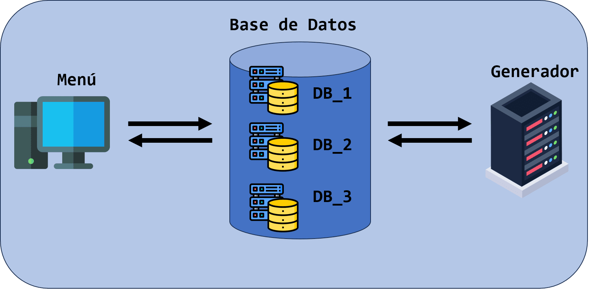

#  Base de Datos Distribuida
## 📄 Descripcion:

En este proyecto se busca simular el concepto basico de una de base de datos distribuida. El sistema consta de una base de datos global dividida en 3 repositorios, un servidor y un cliente. Tambien se toma en cuenta lo siguiente:

- El servidor generara indefinidamente n < 16 CURPS por segundo para ir ingresandolos a la base de datos en un repositorio que se encuentre disponible.
- El menu contara con las siguientes opciones: 
  1 - CURPs por segundo que se generan. 
  2 - Registros totales en la base de datos. 
  3 - Registros en cada repositorio. 
  4 - Bytes de la base de datos y cada repositorio individual. 
  5 - Total de hombres y mujeres en la base de datos. 
  6 - Registros que existen para una entidad. 
- Las entidad federativa de México son: [AS, BC, BS, CC, CS,CH, CL, CM, DF, DG,GT, GR, HG, JC, MC, MN, MS, NT, NL, OC, PL,QT, QR, SP, SL, SR, TC, TL, TS, VZ, YN, ZS]
- Los repositorios almacenaran los CURPS en memoria de programa.
- Esto es meramente practico ya que la capacidad de almacenamiento sera igual al total de memoria disponible en la pc 

### 📊 Esquema

---
## 🖥️ Tecnologías Utilizadas:
- Java 
- Linux (Ubuntu)

---
## 🚧 Proyecto

